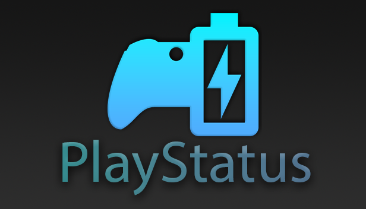
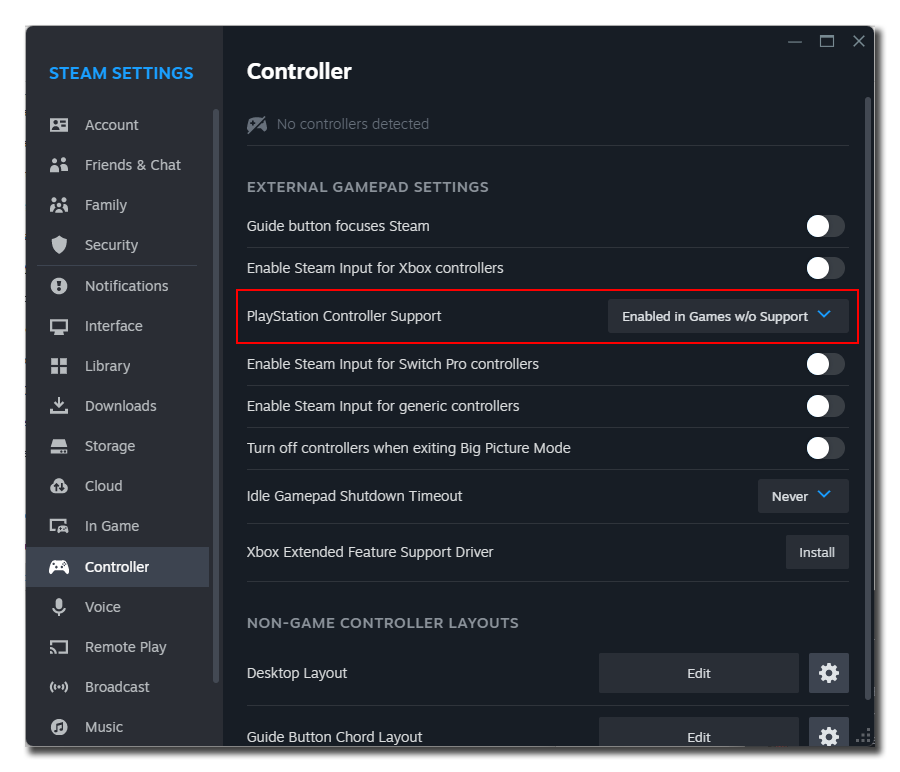

# PlayStatus

## Introduction
PlayStatus is an innovative overlay utility designed for gamers. It enhances your gaming experience by providing real-time updates on your controller's battery life and music playback details. Whether you're using a Dual Sense or Xbox controller, or listening to your favorite tunes on Spotify, YouTube, or Foobar2000, PlayStatus keeps you informed without intrusion.

## Key Features
- **Controller Battery Monitoring:** Get real-time alerts for Dual Sense and Xbox controllers' battery status.
- **Music Playback Integration:** Displays current track details, including artist, song name, and album art.
- **Non-Intrusive Overlay:** Seamlessly integrates into your gaming experience without distractions.
- **Customizable Notifications:** Choose when and how you get your updates.

## Reporting Issues
If you encounter any bugs or issues with PlayStatus, please help us by reporting them. Check out our [Bug Report Template](./BugReport-Template.md) for details on how to create a thorough report.

## Suggesting Features
Your ideas and suggestions are invaluable in making PlayStatus better! If you have a feature in mind that you'd like to see in future versions, please share it with us using the [Feature Request Template](./FeatureRequest-Template.md).

## Where can I get PlayStatus
PlayStatus can be purchased through the Steam Store [here](https://store.steampowered.com/app/2752040).

## Frequently Asked Questions (FAQs)
1. **Controller not working in other games but appearing in PlayStatus?**
   - Ensure that Steam Input is enabled for PlayStatus by right-clicking the game in your Steam Library, going to Properties, then Controller, and ensuring Steam Input is enabled.
   - Particularly for DualSense controllers, make sure that under Steam -> Settings -> Controller
   that "Playstation Controller Support" is set to "Enabled in Games w/o Support."

   

2. **Will using PlayStatus get me flagged by Anti-Cheats?**
   - No, PlayStatus does not involve any kind of injection or memory reading. It's a transparent window that operates within the app's confines. It's 100% safe.

3. **Controller not being detected by PlayStatus, but works fine in games?**
   - Make sure your Xbox controller or Dual Sense controller has the latest firmware. Update Dual Sense controllers using [Sony's official tool](https://controller.dl.playstation.net/controller/lang/en/fwupdater.html). For Xbox, install the "Xbox Accessories" app through the Microsoft Store and update from there. If issues persist, please open an issue.

---

For more information, visit https://ckproductions.dev/
